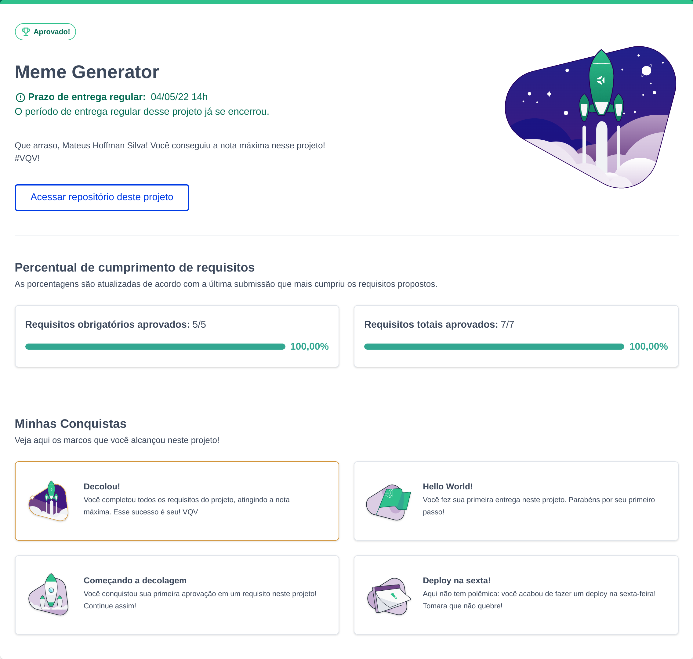

# 💚💚 Trybe-Project-07-Meme-Generator 💚💚

Project responsible for presenting my skills with HTML, CSS and JavaScript

## Access the project:
### https://mateushoffman.github.io/Trybe-Project-07-Meme-Generator

## NOTA - 100%

	

## Preview:

	

## Connect with me:

	  
	
	

